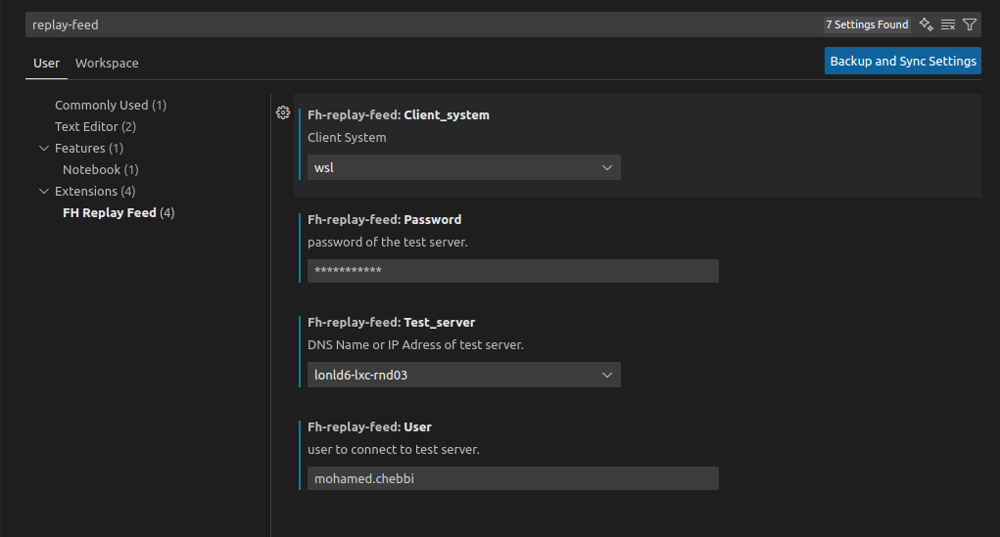

# fh-replay-feed README

The goal of this graphical extension is to simplify the use of the mcast_tool, in order to replay the stored raw feed.

## Requirements

sshpass is required to use this extension.

## Extension Settings

Once the plugin is installed, you need to check if default settings are good. (Cltr+,)

## How does It work

Once Installed, a new icon will appear in the activity bar 

Click on this icon, a new side bar will appear containing all market data stored in the raw_data server

Once a specific source and date of replay are choosen, click on 'view details"
A new web view will appear and from here, you could start your replay request

You could stop the replay any time you want

-----------------------------------------------------------------------------------------------------------
